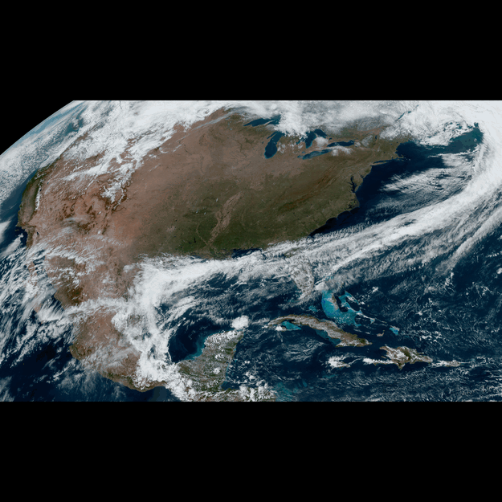

# RAMMB/CIRA SLIDER CLI

A command-line implementation of the RAMMB/CIRA SLIDER tool in Golang.

This is not an official product of NOAA, RAMMB, or CIRA.

## Example Usage

```bash
slider-cli --satellite=goes-16 --sector=conus --product=band-1
```



## Feature To-Do List

- [x] Loop
- [ ] Rock
- [ ] Reverse
- [x] Speed
- [x] Zoom (Resolution)
- [ ] Pan/Crop
- [ ] Rotation
- [ ] Slider
- [x] Satellite Selection
- [x] Sector Selection
- [x] Product Selection
- [ ] Product Overlays
- [ ] Overlay Opacity
- [x] Number of Images
- [x] Time Step
- [ ] Map Overlays
- [ ] Lat/Lon Overlays
- [ ] Begin Date
- [ ] End Date
- [x] Animated GIF
- [ ] Animated PNG
- [ ] Separate Images
- [ ] Follow Feature
- [ ] URL Parsing
- [ ] Complete Satellite List
- [ ] Complete Sector List
- [ ] Complete Product List
